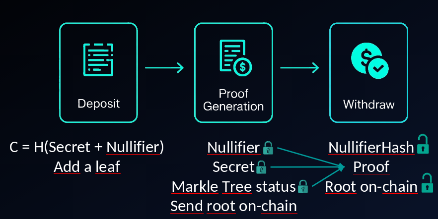

# Laundeth

**An educational Ethereum privacy pool implementation demonstrating Zero-Knowledge Proof integration with smart contracts.**

Laundeth is a mixer / anonymity pool prototype where users deposit a fixed ETH amount and later withdraw to any arbitrary address without creating an on‑chain link between deposit and withdrawal.

## 🎯 Project Highlights

- **Zero-Knowledge Proofs**: Implemented zkSNARK circuits using ZoKrates with Groth16 proving scheme
- **Privacy-Preserving Architecture**: Merkle tree-based commitment scheme with off-chain proof generation
- **Smart Contract Security**: Built with OpenZeppelin standards (ReentrancyGuard, Ownable) and gas-optimized patterns
- **Cryptographic Primitives**: SHA-256 hashing, nullifier mechanisms, and commitment schemes
- **Full-Stack Development**: Solidity contracts, ZoKrates circuits, JavaScript tooling, and Truffle deployment

> **⚠️ Educational Purpose**: This project is for learning and demonstration purposes only. Not audited—do not use with real funds.

## Core Concepts

The protocol combines:

* **Cryptographic commitments** built off‑chain from (secret, nullifier)
* **Merkle tree** aggregating commitments whose roots are published on‑chain
* **Zero‑Knowledge Proofs** proving membership and non‑reuse without revealing secrets
* **On‑chain security controls** preventing double spend and reentrancy attacks

## Why a fixed amount?
Using a uniform amount (1 ETH) makes all notes value‑indistinguishable. Variable amounts would enable trivial value correlation attacks reducing anonymity.

## High‑Level Flow



1. Off‑chain generation: user creates (secret, nullifier) → commitment = H(secret || nullifier).
2. Merkle insertion: commitment added off‑chain, producing a new root.
3. Root publication: operator (or process) calls `updateRoot` with the new root.
4. Deposit: user calls `deposit(commitment)` sending exactly 1 ETH; contract records the commitment (anti‑replay) and increases pool balance.
5. Withdrawal: later the user builds a ZK proof showing (a) commitment is part of a published root; (b) secrets are known; (c) nullifier not yet used. Proof + public inputs (split root & nullifier limbs) are sent to `withdraw` with the recipient.
6. On‑chain verification: contract reconstructs `bytes32` from eight 32‑bit limbs, checks root and nullifier state, verifies the proof via the ZoKrates verifier, then transfers ETH.

## Data Format (root / nullifier)
For circuit compatibility, root and nullifier are passed as `uint256[8]` where each element must fit 32 bits. On‑chain they are concatenated big‑endian forming a `bytes32`.

## Key Design Choices
| Aspect | Choice | Rationale |
|--------|--------|-----------|
| Amount | Fixed (1 ETH) | Maximize anonymity set uniformity |
| Merkle storage | Roots only (historical) | Gas saving; tree off‑chain |
| Double spend guard | nullifierHash mapping | O(1) lookup to block reuse |
| Security | ReentrancyGuard + sendValue | Defensive pattern |

## Limitations / Threat Model (Brief)
* Operator withholding roots can delay withdrawals (off‑chain censorship).
* Timing analysis: a single deposit before a withdrawal weakens privacy.
* Trusted setup: compromised ceremony could allow forged proofs.
* No relayer: direct withdrawal may leak metadata (IP, timing). A relayer + fee improves this.

## Main Features

- **Anonymous deposit**: Off‑chain commitment generation with uniform deposit value.
- **Private withdrawal**: ZK membership + non‑spent proof without revealing Merkle path.
- **Merkle Tree management**: Published roots decouple withdrawal timing.
- **Security**: Reentrancy guard, fixed amount check, nullifier tracking, strict public input packing.

## Tech Stack

**Smart Contracts:**
- Solidity ^0.8.2
- [OpenZeppelin Contracts](https://www.openzeppelin.com/) ^4.4.2 (Ownable, ReentrancyGuard, Address utilities)

**Development Framework:**
- [Truffle](https://archive.trufflesuite.com/) - Smart contract compilation, deployment, and testing
- [Ganache](https://archive.trufflesuite.com/ganache/) - Local Ethereum blockchain for development

**Zero-Knowledge Proofs:**
- [ZoKrates](https://zokrates.github.io/gettingstarted.html) - zkSNARK circuit design and proof generation
- Groth16 proving scheme with pairing-based verification

**Runtime & Tools:**
- Node.js 18+
- JavaScript (deployment scripts and testing)

## How to Run the Project

1. Install dependencies:
   ```fish
   npm install
   ```

2. Compile contracts:
   ```fish
   npx truffle compile
   ```

3. Compile the circuit with Zokrates following the [Zokrates Wiki](https://zokrates.github.io/gettingstarted.html):

4. Start a local blockchain (Ganache) and migrate contracts:
   ```fish
   npx truffle migrate
   ```

5. Run test
   ```fish
   truffle exec scripts/test.js --network ganache
   ```

**Author**: [0xSirel](https://github.com/0xSirel)  
